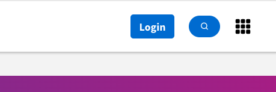
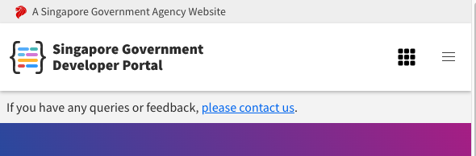

# Dev Console Integration Guide

This documentation goes through the different ways to implement dev console widget into a web application.

Dev console widget is a web component built with [litjs](https://lit.dev/).

## Resources

- [Live Demo](https://docs.developer.tech.gov.sg/)
- [Technical Documentation](https://confluence.ship.gov.sg/display/DEV/Developer+Console+Widget?src=contextnavpagetreemode)
- [Self Publishing Repository](https://github.com/GovTechSG/dev-console-products-info)

## Script Environments

Based on the environments that you are deploying your application to, you might want to inject different widget bundle scripts.

We are serving the bundled scripts from 3 separate envs `dev` , `stg` and `prod`. Domains in the script url are prefixed with the env except for prod. For e.g

### Prod
`https://assets.developer.tech.gov.sg/...`

### Env Specific
`https://dev.assets.developer.tech.gov.sg/...`

`https://stg.assets.developer.tech.gov.sg/...`

On doc portal, we inject environment specific dev console widget bundle i.e doc portal's `dev` env will inject `https://dev.assets.developer.tech.gov.sg/...`, `stg` will inject `https://stg.assets.developer.tech.gov.sg/...` and `prod` will inject `https://assets.developer.tech.gov.sg/...`.

Experimental changes to widget are, most of the time, pushed to `dev` and `stg`.

## Widget Placement Guide

Our guideline is to place the widget on the `far right in desktop view` and `on the left of hamburger in mobile view`. An example is shown below.

**Desktop**  

**Mobile**  
