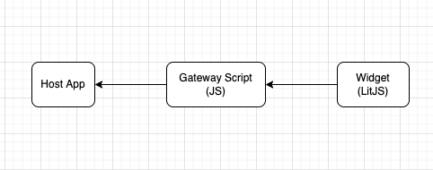

# Overview

Dev Console Widget is an embeddable dropdown widget to provide ubiquitous navigation to SGTS products and its services.

Technically, it is a web component built with [litjs](https://lit.dev/). See widget [live](https://docs.developer.tech.gov.sg/) on doc portal. 

This section of the documentation goes through technical details of developer console widget. To start incorportating the widget in your application and to find out how to publish content on the widget, read `Integration Guide` and `Publishing Widget Content` respectively.

## High Level Flow
Widget is a web component that is injected into host app through a script delivered through a script tag in 2 steps :

1. Host app injects gateway script in html
2. Gateway script fetches latest version of widget and injects into host app's html

User can then utilise the widget anywhere in the app through using the custom html tags `<dev-console-widget><dev-console-widget>`.

Properties can also be passed in to adjust the widget's color, width and height. Find out more on how to integrate the widget in the `Integration Guide` section of this documentation.

## Resources
- [Gitlab Repository](https://gitlab-in.ship.gov.sg/developer-portal/dev-console-mvp/dev-console-systems)
- [Self Publishing GitHub Repository](https://github.com/GovTechSG/dev-console-products-info)
- [Telegram channel](https://t.me/+k87OuBm9MARkYjk1)
- [Framework Decision Process](https://confluence.ship.gov.sg/display/DEV/Technical+Spec+For+All+Products+Widget)