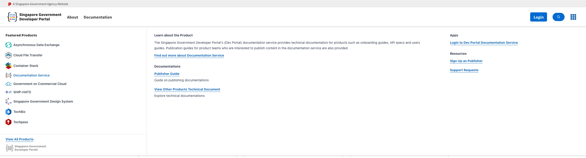

# Dev Console Integration Guide

This documentation goes through the different ways to implement dev console widget into a web application.

Dev console widget is a web component built with [litjs](https://lit.dev/).



<hr>

## Application Bundles Breakdown
#### Gateway Script

https://dev.assets.developer.tech.gov.sg/bundled-scripts/dev-console-gateway.bundle.js
#### Web Component Scripts
- https://dev.assets.developer.tech.gov.sg/bundled-scripts/dev-console-widget.bundle.js
- https://dev.assets.developer.tech.gov.sg/bundled-scripts/dev-console-widget.es5.bundle.js

Application host will inject the gateway script in the header which will in turn inject the relevant web component scripts. Example:

```html
<script type="module" id="dev-console-gateway" src="https://dev.assets.developer.tech.gov.sg/bundled-scripts/dev-console-gateway.bundle.js" es5 polyfills></script> 
```
Add in attributes ```es5``` and ```polyfills``` to inject the ```es5``` version of bundled script and relevant polyfills. They are **optional**.

We recommend not including them if your application do not plan to support older browsers.

Web component can be used in this manner:

```html
  <dev-console-widget
    iconColor="black" --> default icon color
    iconWidth="24px"  --> icon width
    iconHeight="24px" --> icon height
    activeColor="blue" --> active and hover color for icon
  ></dev-console-widget>
```
<hr>

## Important Caveats

1. The web component has a dropdown which is ```position:absolute``` to the navbar container. If you are using [sgds](https://www.designsystem.tech.gov.sg/), it will be relative to ```sgds-navbar``` class. If you are not using [sgds](https://www.designsystem.tech.gov.sg/) then you will have to set your custom navbar container as ```position:relative``` for the dev-console-widget dropdown to behave properly.

2. dev-console-widget component should be an independent nav item that does not collapse with other nav items into a hamburger menu. 

    For example :

```html
 <div class="sgds-container">
      <div class="sgds-navbar-brand">
          <a class="sgds-navbar-item" href="/">
              
          </a>
          <div class="sgds-navbar-item has-dropdown is-hoverable is-mega">
              <dev-console-widget iconColor="black" iconWidth="24px" iconHeight="24px"></dev-console-widget>
          </div>
          <div class="sgds-navbar-burger" data-target="sgds-navbar-main">
              <span></span>
              <span></span>
              <span></span>
          </div>
      </div>
      <div id="sgds-navbar-main" class="sgds-navbar-menu">
          <div class="sgds-navbar-start">
            <div>Navbar Item 1</div>
            <div>Navbar Item 2</div>
            <div>Navbar Item 3</div>
          </div>
          <div class="sgds-navbar-end">
              ...
          </div>
      </div>
  </div>
```


<hr>

## Integration

Currently this widget can be consumed by host application through a script tag and below are the guides for the integration.

### **Static Html**

Utilising with static html is relatively straight forward. Just add gateway script tag into file that is used everywhere within the application e.g layout.html etc.

This will also work if you're utilising static html or server side rendered html together with a frontend javascript framework such as React or Vue. For details on client side script injection, refer to the portions below.

### **React Application**

For SPA's, the gateway script tag should be injected in the ```useEffect``` method of ```navbar``` component or components of similar nature.

```js
useEffect(() => {
  const script = document.createElement('script');
  script.async = true;
  script.id = `dev-console-gateway`;
  script.type = `module`;
  // script.setAttribute('es5', '');
  // script.setAttribute('polyfills', '');
  script.src =
    'https://dev.assets.developer.tech.gov.sg/bundled-scripts/dev-console-gateway.bundle.js';
  document.head.appendChild(script);

  return () => {
    document.head.removeChild(script);
  };
}, []);
```
```html
<div className="sgds-masthead">
  <a href="https://www.gov.sg" target="_blank">
    <span className="sgds-icon sgds-icon-sg-crest"></span>
    <span className="is-text">A Singapore Government Agency Website</span>
  </a>
</div>
<nav className="sgds-navbar" role="navigation">
  <div className="sgds-navbar-brand">
    <span className="sgds-navbar-item">
      <Link id="techpay-logo" to="/">
        
      </Link>
    </span>
    <div className="sgds-navbar-item has-dropdown is-hoverable is-mega">
      <dev-console-widget
        iconColor="black"
        iconWidth="24px"
        iconHeight="24px"
      ></dev-console-widget>
    </div>
    <div
      className={`sgds-navbar-burger ${
        isBurgerActive ? 'is-active' : ''
      }`}
      data-target="mainnav-1"
      onClick={() => setIsBurgerActive(!isBurgerActive)}
    >
      <span></span>
      <span></span>
      <span></span>
    </div>
  </div>
```
You could also consider extracting this logic out into its own [hook](https://reactjs.org/docs/hooks-intro.html).

?> If you're using typescript, you will need to declare type in your respective *.d.ts file.

Example below is declared in global.d.ts file.

```ts
declare namespace JSX {
  interface IntrinsicElements {
    'dev-console-widget': any;
  }
}
```

### **Angular Application**

Inject gateway script in ```index.html``` or relevant html files.

You will need to add ```CUSTOM_ELEMENTS_SCHEMA``` into the relevant application module to enable web components. For more information, refer [here](https://vaadin.com/learn/tutorials/using-web-components-in-angular). Example:

```js
@NgModule({
    declarations: [
        ...
    ],
    imports: [
       ...
    ],
    providers: [
        {
         ...
        }
    ],
    schemas: [CUSTOM_ELEMENTS_SCHEMA]
})
```
You can then use the web component as per normal.

### **Vue Application**

If you're building a SPA with Vue, the script tag will have to injected during runtime similar to React. This could be added in the ```created()``` lifecycle hook and cleanedup in ```beforeDestroy()``` hook.

!> I have not personally tried this out.

```js
created(){
  const script = document.createElement('script');
  script.async = true;
  script.id = `dev-console-gateway`;
  script.type = `module`;
  // script.setAttribute('es5', '');
  // script.setAttribute('polyfills', '');
  script.src =
    'https://dev.assets.developer.tech.gov.sg/bundled-scripts/dev-console-gateway.bundle.js';
  document.head.appendChild(script);
}
...
beforeDestroy(){
  document.head.removeChild(script);
}
```

You can also consider extracting this logic out into a composable using [composition api](https://vuejs.org/guide/extras/composition-api-faq.html).