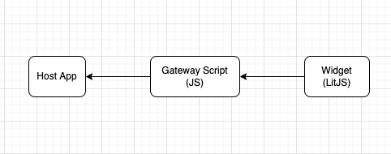

# Javascript Bundles Breakdown



## Gateway Script

https://assets.developer.tech.gov.sg/bundled-scripts/dev-console-gateway.bundle.js

Application host will inject the gateway script in the header which will in turn inject the relevant web component scripts. Example:

```html
<script type="module" id="dev-console-gateway" src="https://assets.developer.tech.gov.sg/bundled-scripts/dev-console-gateway.bundle.js"></script> 
```
Add in attributes ```es5``` and/or ```polyfills``` to inject the ```es5``` version of bundled script and relevant polyfills. They are **optional**. E.g :

```html
<script type="module" id="dev-console-gateway" src="https://assets.developer.tech.gov.sg/bundled-scripts/dev-console-gateway.bundle.js" es5 polyfills></script> 
```
We recommend not including them if your application do not plan to support older browsers.

## Web Component Scripts
- https://assets.developer.tech.gov.sg/bundled-scripts/dev-console-widget.bundle.js
- https://assets.developer.tech.gov.sg/bundled-scripts/dev-console-widget.es5.bundle.js

These are scripts injected by the gateway scripts and contains the actual web component code for widget.

## Script Environments

Based on the environments that you are deploying your application to, you might want to inject different widget bundle scripts.

We are serving the bundled scripts from 3 separate envs `dev` , `stg` and `prod`. Domains in the script url are prefixed with the env except for prod. For e.g

### Prod
`https://assets.developer.tech.gov.sg/...`

### Env Specific
`https://dev.assets.developer.tech.gov.sg/...`

`https://stg.assets.developer.tech.gov.sg/...`

On doc portal, we inject environment specific dev console widget bundle i.e doc portal's `dev` env will inject `https://dev.assets.developer.tech.gov.sg/...`, `stg` will inject `https://stg.assets.developer.tech.gov.sg/...` and `prod` will inject `https://assets.developer.tech.gov.sg/...`.

Experimental changes to widget are, most of the time, pushed to `dev` and `stg`.