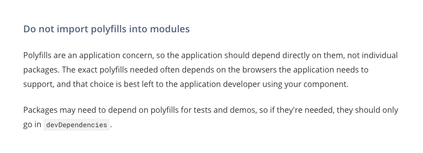

# Backward Browsers Compatibility

Lit's guide on [polyfill](https://developer.mozilla.org/en-US/docs/Glossary/Polyfill) and browser requirements : https://lit.dev/docs/tools/requirements/#building-for-legacy-browsers.

## ES5 Compilation

We are not building a web application but we should still take care of compiling down modern javascript for backward compatibility using babel.

Babel is used in our project to bundle down es6 into es5. This is done solely for older browser support.

## Polyfills

In general, the recommendation by lit, open-wc and the web-components community is to not import polyfills into modules as polyfills are application concern. The polyfills mentioned from the link above is for web applications that are built with lit which has an entry point.



[Link to content from above picture.](https://lit.dev/docs/tools/publishing/#do-not-import-polyfills-into-modules).

Although we are not importing that many pollyfills and leaving it to the host application, we should still provide options for them to load some polyfills important for our widget through our gateway scripts. We then load these polyfills as script tags.

**gateway script**
```js
    webComponentPolyfill.src =
      "https://cdn.jsdelivr.net/npm/@webcomponents/webcomponentsjs@2.6.0/webcomponents-bundle.js";
    webComponentPolyfill.integrity =
      "sha256-1+fM2cWLfD4U7zyskE2Z21Aq3iHra5ySDLHNr9S/Cp4=";
    webComponentPolyfill.crossOrigin = "anonymous";

    const fetchPolyfill = document.createElement("script");
    fetchPolyfill.src =
      "https://cdn.jsdelivr.net/npm/whatwg-fetch@3.6.2/dist/fetch.umd.js";
    fetchPolyfill.integrity =
      "sha256-+pQdxwAcHJdQ3e/9S4RK6g8ZkwdMgFQuHvLuN5uyk5c=";
    fetchPolyfill.crossOrigin = "anonymous";

    const promisePolyfill = document.createElement("script");
    promisePolyfill.src =
      "https://cdn.jsdelivr.net/npm/promise-polyfill@8/dist/polyfill.min.js";
    promisePolyfill.integrity =
      "sha256-6W8rLN6XbnQSNsU1iq+8JbNSfutzQxUh2neEFPq9wtQ=";
    promisePolyfill.crossOrigin = "anonymous";

    document.head.appendChild(webComponentPolyfill);
    document.head.appendChild(fetchPolyfill);
    document.head.appendChild(promisePolyfill);
```

Here are some of the polyfills we help to inject :

- [web component polyfills](https://github.com/webcomponents/polyfills)
- [fetch api polyfill](https://github.com/github/fetch)
- [promise polyfill](https://www.npmjs.com/package/promise-polyfill)