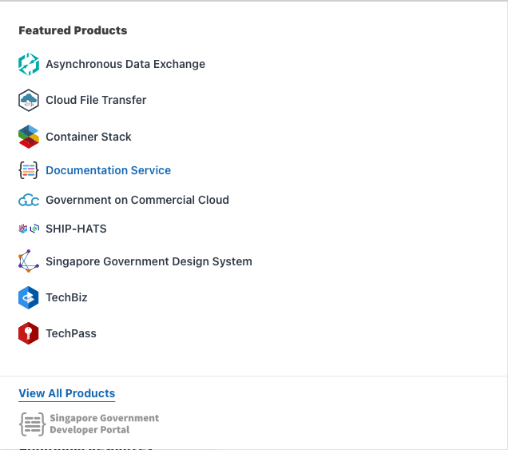
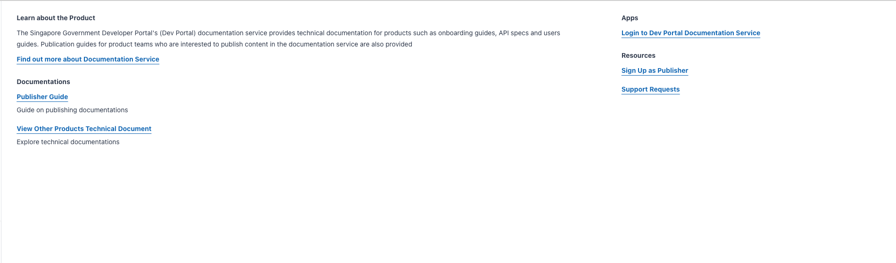
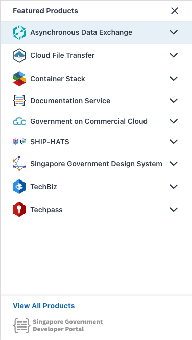

# Feature Breakdown
Dev Console Widget can be broken down into 3 main parts and the mobile view:

- Dropdown Icon
- Left Browse Products Menu
- Right Product Details Portion
- Mobile View

## Dropdown Icon

## Left Browse Products Menu

## Right Product Details Portion

The data shown here is not static but is consumed from a json file fetched from s3 bucket from the path `/product-details/`.

## Mobile View

